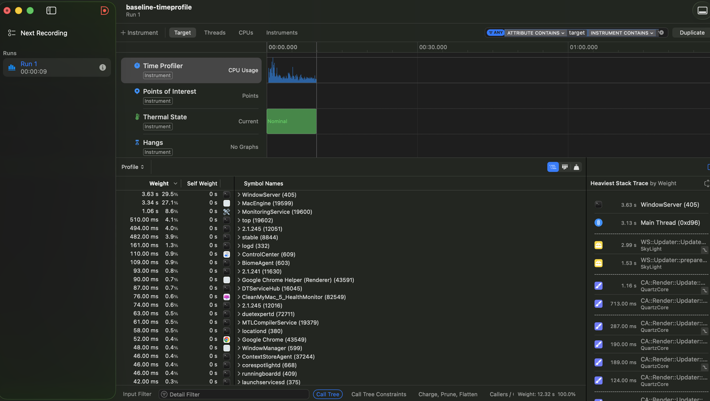
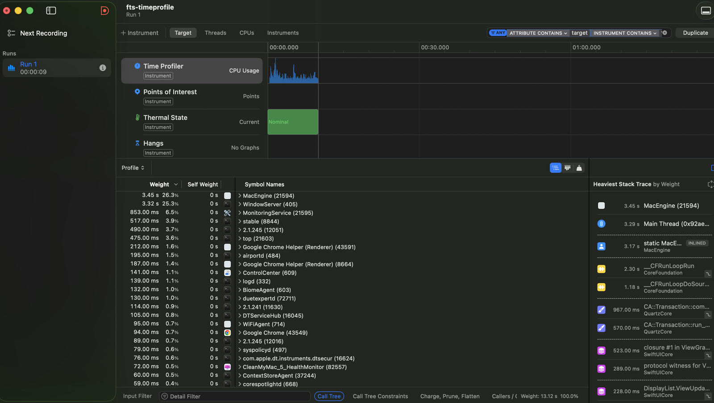

# Instruments

What the profiler actually said, what changed because of it, and what the change
was worth. Every number here is reproducible with the commands quoted beside it.

## Method

The workspace scan does not run in the app. The app asks the monitoring service
over XPC and the service does the walking, so the process worth profiling is the
child, not the one that owns the window.

The scan is normally started from an `NSOpenPanel`, which cannot be driven from a
trace script, and a before/after number is worthless unless both runs did
identical work. So the app takes a launch argument:

```sh
MacEngine.app/Contents/MacOS/MacEngine -scanPath ~/WORK/ReviveMe/ReviveMe.xcodeproj
```

Traces were recorded headlessly and the sample counts read out of the trace file
rather than off the screen, which is why the tables below have exact figures:

```sh
xcrun xctrace record --template 'Time Profiler' --all-processes --time-limit 9s \
  --no-prompt --output baseline.trace
xcrun xctrace export --input baseline.trace \
  --xpath '/trace-toc/run[@number="1"]/data/table[@schema="time-profile"]'
```

All measurements are Release builds on an M-series MacBook Air, warm metadata
cache, against a 15-location scan totalling ~11 GB.

## What the Time Profiler said

Of 1132 samples attributed to `MonitoringService`, `DiskWalker.measure` accounted
for 263 — essentially all of the scan. The breakdown inside it was the finding:

| Frame | Samples | Share of the walk |
| --- | ---: | ---: |
| `URL.resourceValues(forKeys:)` | 114 | 43% |
| `NSURLDirectoryEnumerator.nextObject` / `_URLEnumeratorGetNextURL` | 88 | 33% |
| `Dictionary._unconditionallyBridgeFromObjectiveC` | 36 | 14% |
| `getattrlistbulk` (the actual syscall) | 10 | 4% |

The filesystem was not the bottleneck. Reading the directory cost almost nothing;
wrapping each result cost nearly everything. For every file, Foundation allocated
a `CFURL`, called into `_FSURLCopyResourcePropertiesForKeysInternal`, built an
`NSDictionary`, and bridged it into Swift — so that one integer could be read
out of it.



## The change

`DiskWalker.measure` was `FileManager.enumerator` plus `resourceValues(forKeys:)`.
It is now `fts(3)`, which hands back a `struct stat` per entry and allocates
nothing:

```swift
guard let stream = fts_open(&roots, FTS_PHYSICAL | FTS_NOCHDIR, nil) else { … }
while let entry = fts_read(stream) {
    if Int32(entry.pointee.fts_info) == FTS_F, let status = entry.pointee.fts_statp {
        total.bytes += UInt64(max(status.pointee.st_blocks, 0)) * 512
        total.files += 1
    }
}
```

`FTS_PHYSICAL` keeps symlinks from being followed, matching the old enumerator.
`FTS_NOCHDIR` is load-bearing rather than cosmetic: without it fts walks by
changing the process working directory, and this loop suspends at `Task.yield()`
and resumes on whatever thread the cooperative pool hands it.

`st_blocks` is defined in 512-byte units and counts blocks the file actually
occupies — the same question `totalFileAllocatedSize` was being asked. On this
tree the two agree to the byte.

## What it was worth

Isolated harness, same two directories (ModuleCache.noindex + a DerivedData
folder, 10237 files), best of five runs, `/usr/bin/time -l`:

| | FileManager | fts(3) | Change |
| --- | ---: | ---: | ---: |
| User CPU | 0.05 s | 0.01 s | **−80%** |
| System CPU | 0.06 s | 0.06 s | unchanged |
| Wall clock | 0.06 s | 0.04 s | −33% |
| Peak footprint | 4.42 MB | 3.92 MB | −11% |

Those two middle rows are the whole point. System time did not move, because the
same syscalls are being made against the same files. User time fell by four
fifths, because the work that disappeared was all in userspace.

In the trace, `DiskWalker.measure` fell from 263 samples (23.2% of the service)
to 33 (3.6%). The `URL.resourceValues` frames still present afterwards belong to
`DiskSampler`, which reports free space, not to the walker.



End to end, the full 15-location scan went from **1.45 s to 1.27 s, about 13%**.
The gap between −80% CPU and −13% wall clock is the honest result: this workload
is I/O bound, four walkers are already waiting on the disk most of the time, and
removing CPU from a process that is mostly blocked returns only part of itself.
Reporting the 80% alone would be a lie by omission.

## The bug the profiler found by accident

fts counted 933 more files and 546,680,832 more bytes than the old
implementation. That gap is not a difference of metric — it was silently missing
data.

`DiskWalker.scan` hands each top-level child to `measure`, and `measure` opened a
*directory* enumerator on it. Handed a plain file, a directory enumerator yields
nothing at all. Every file sitting directly in a scanned folder was counted as
zero bytes.

| Location | Top-level files missed | Bytes missed |
| --- | ---: | ---: |
| `ModuleCache.noindex` | 921 | 546,516,992 |
| `org.swift.swiftpm` | 3 | 118,784 |
| DerivedData (ReviveMe) | 5 | 20,480 |
| Project directory | 3 | 20,480 |
| `CoreSimulator/Devices` | 1 | 4,096 |
| `SymbolCache.noindex` | 0 | 0 |

933 files and 546 MB, which is exactly the gap. `SymbolCache.noindex` has no
top-level files, which is precisely why its count matched before and after — the
control case that confirms the explanation. fts now agrees with `find -type f`
exactly on every location tested.

Covered by `DiskWalkerTests.testFilesDirectlyInTheRootAreCounted`.

## Walker count, measured rather than asserted

`DiskWalker.defaultConcurrency` was 4 with a comment promising to measure it.
Six locations, 9.36 GB, best of three runs each:

| Walkers | 1 | 2 | 4 | 8 | 16 | 32 |
| --- | ---: | ---: | ---: | ---: | ---: | ---: |
| Seconds | 0.445 | 0.376 | **0.366** | 0.371 | 0.371 | 0.373 |

Parallelism is worth 18% and it is all collected by the fourth walker. Past that
the curve is flat to within noise — consistent with a workload bounded by the
disk rather than by cores. The original guess survives, now with a reason.

## Leaks

`leaks(1)` against both processes after a full workspace scan:

```
Process 22560 (MacEngine):         0 leaks for 0 total leaked bytes.
Process 22562 (MonitoringService): 0 leaks for 0 total leaked bytes.
```

Traces were also recorded with the Leaks template (`--attach <pid>`); the CLI is
quoted here because it produces a checkable text result rather than a screenshot.

## Scoping

Two limits worth stating rather than hiding.

The Allocations and Leaks instruments do not expose their data through
`xctrace export`, so the memory figures above come from `/usr/bin/time -l` and
`leaks(1)` instead of from the trace files. The traces exist and open in
Instruments; they are simply not the source of the numbers.

The isolated harness compiles `DiskWalker.swift` directly with `swiftc -O` rather
than running the app, which is what makes an old-vs-new comparison in one process
possible. The end-to-end 1.45 s → 1.27 s figure is from the real app and the real
XPC service, and is the number that should be believed about the product.
