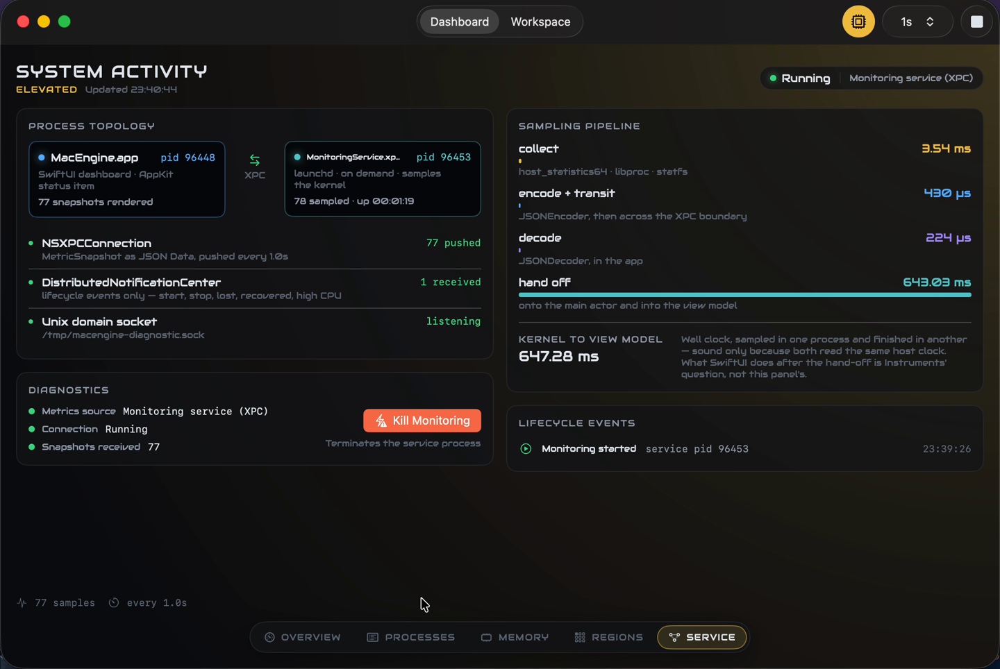
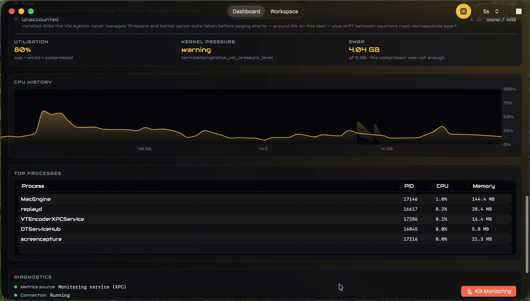

# MacEngine

A macOS system monitor built as two processes on purpose. The window does not
read a single kernel API — it holds an `NSXPCConnection` to an isolated service
that does all the sampling, and the service pushes snapshots back.

[](Documentation/media/MacEngine.mp4)

<!-- Click-through opens GitHub's own player for the file in this repo. For a
     player embedded directly in this page instead, drag
     Documentation/media/MacEngine.mp4 into any issue comment, copy the
     https://github.com/user-attachments/assets/... URL it produces, and replace
     the line above with:
       <video src="THAT_URL" controls width="100%"></video>          -->

The whole product in forty seconds: the sampling pipeline timing every stage
from `host_statistics64` to the view model, the kernel's own memory
composition, both processes' address spaces walked region by region, and two
workspace scans resolving an Xcode project's DerivedData and measuring it with
`fts(3)`. The only cuts are the file picker.

## What it does

**Multi-process by design.** The UI never touches `host_statistics64`. It holds
an `NSXPCConnection` to a sandboxed-off XPC service that does all sampling, and
the service pushes snapshots over a reverse proxy object at 1 Hz — bidirectional,
not request/response.

**Survives its own backend dying.** Kill the service from a button in the app.
The connection invalidates, the UI shows degraded state, launchd relaunches on
the next message, and metrics resume — typically within about five seconds.



The red button terminates the service process and the dashboard resumes against
a **new pid** — while the chart keeps its history, because the history lives on
the app side of the boundary.

**Two transports, chosen deliberately.** Streaming metrics go over XPC. Lifecycle
events go over `DistributedNotificationCenter`. Continuous data and rare state
changes have different delivery requirements, so they do not share a pipe.

**Real VM, not a percentage.** Engineer Mode breaks memory into what the kernel
actually tracks — wired, active, inactive, speculative, compressed, free — and
shows the kernel's own `kern.memorystatus_vm_pressure_level` next to the
utilisation band, because a full page cache is not memory pressure.

**Address space maps of both processes.** `mach_vm_region_recurse` walks the
app's and the service's own regions, classified into heap, stack, text, mapped
files and reserved. On this Mac that surfaces ~440 GB of `VM_PROT_NONE`
reservations holding zero resident pages.

**Two front doors.** The service also listens on a Unix domain socket at
`/tmp/macengine-diagnostic.sock`, speaking a line-oriented text protocol. A
`macengine-cli status` binary is one client; `nc -U` is an equally valid one.
Same data, no XPC interface, no wire types, no framework — which is the point
of choosing text over a typed protocol for a diagnostic channel.

**Measured, not asserted.** The directory walk was the hot path. The Time
Profiler showed 43% of it inside `URL.resourceValues(forKeys:)` and only 4% in
the actual syscall — Foundation was allocating a CFURL and bridging an
NSDictionary per file to read one integer. Replacing it with `fts(3)` cut user
CPU by 80% and, incidentally, uncovered 546 MB the old walker had been silently
dropping. Full numbers in [Documentation/instruments.md](Documentation/instruments.md).

## Architecture

```
 ┌──────────────────────────── MacEngine.app ────────────────────────────┐
 │                                                                       │
 │   SwiftUI dashboard          StatusItem            Workspace tab      │
 │          │                       │                      │             │
 │          └───────────┬───────────┴──────────────────────┘             │
 │                      │                                                │
 │            DashboardViewModel / WorkspaceInspectorViewModel           │
 │                      │                                                │
 │             XPCMetricsProvider ── connection state machine            │
 └──────────────────────┬───────────────────────────────────▲────────────┘
                        │                                   │
   NSXPCConnection      │  snapshots pushed 1 Hz            │  Distributed
   Codable → Data       │  scan progress + result           │  Notification-
                        │  ◄── reverse proxy object         │  Center:
                        ▼                                   │  lifecycle events
 ┌──────────────────────┬─ MonitoringService.xpc ───────────┴────────────┐
 │                                                                       │
 │   MetricsCollector ── 1 Hz sampling loop                              │
 │      ├── CPUSampler           host_statistics64                       │
 │      ├── MemorySampler        vm_statistics64                         │
 │      │                        vm.swapusage                            │
 │      │                        memorystatus_vm_pressure                │
 │      ├── DiskSampler          statfs                                  │
 │      ├── ProcessSampler       proc_listpids + rusage                  │
 │      │                        bounded top-K heap                      │
 │      └── AddressSpaceSampler  mach_vm_region_recurse                  │
 │                                                                       │
 │   WorkspaceScanner ── one-off heavy job                               │
 │      └── DiskWalker           fts(3), 4 walkers                       │
 │                                                                       │
 │   DiagnosticSocket ── AF_UNIX, line protocol                          │
 │      └── /tmp/macengine-diagnostic.sock                               │
 │                                                                       │
 └─────────────────────────────────┬─────────────────────────────────────┘
                                   │  status · snapshot · help
                                   │  (any AF_UNIX client)
                                   ▼
                    ┌──────────────┬───────────────┐
                    │  macengine-cli   ·   nc -U   │
                    │  ProcessEnumerator  (ObjC)   │
                    └──────────────────────────────┘
```

The app and the service link a shared `Shared/` group: the wire types are plain
`Codable` structs sent across XPC as `Data`, which avoids `NSSecureCoding`
boilerplate entirely and means the same file defines both ends of the protocol.

The CLI links none of it, on purpose. It speaks the socket's text protocol with
raw syscalls, which is the proof that the second door needs no client library —
if the CLI had imported the wire types, `nc` would not have been a valid client.

## Running it

Requires **macOS 26.5** or later and **Xcode 26** — the deployment target is
26.5 and the project uses file-system-synchronized groups, so an older Xcode
will not open it.

```sh
open MacEngine.xcodeproj      # scheme: MacEngine
```

### Getting around

Two top-level tabs, **Dashboard** and **Workspace**, each divided into sections
reachable from a dock at the bottom of the window. Nothing scrolls: every
section is sized to fit, so a panel is either on screen in full or behind one
click.

| Dashboard | Workspace |
| --- | --- |
| **Overview** — CPU, memory and disk, plus 60 seconds of CPU history | **Summary** — totals, and where the scan looked |
| **Processes** — top processes by footprint | **Breakdown** — every location, largest first |
| **Memory** — the kernel's VM composition | **Reclaimable** — what is safe to delete |
| **Regions** — address-space maps of both processes | **Toolchain** — Xcode's live processes |
| **Service** — topology, pipeline timing, diagnostics, lifecycle events | |

Engineer Mode is the `cpu` toggle in the toolbar. It is what fills the Memory,
Regions and Service sections; with it off the app is an ordinary system monitor
and those sections offer to turn it on.

With the app running, the same service answers on the socket:

```sh
macengine-cli status        # service and machine state
macengine-cli snapshot      # the latest reading as JSON
macengine-cli processes     # top processes, read straight from the kernel
nc -U /tmp/macengine-diagnostic.sock   # then type: status
```

For profiling, the app takes a launch argument that starts a workspace scan
without the open panel:

```sh
MacEngine.app/Contents/MacOS/MacEngine -scanPath ~/some/Project.xcodeproj
```

## Tests

```sh
xcodebuild -project MacEngine.xcodeproj -scheme MacEngine test
```

107 tests, a mix of XCTest and Swift Testing. The unit tests cover the things
with real logic — CPU tick-delta normalisation, VM page composition summing to
installed RAM, bounded top-K selection, directory size roll-up, region
classification, chart windowing.

Eight integration tests drive the real XPC boundary rather than a mock: a round
trip returning a valid snapshot, a check that the pid answering is not the
caller's, a reconnect-after-crash asserting the relaunched service is a *new*
process, and a workspace scan that must report progress and honour cancellation.

Four more drive the diagnostic socket with raw `socket`/`connect`/`write` calls
instead of the CLI's own client — so a protocol change that broke every other
caller cannot pass by virtue of both sides sharing code.

## Deliberate limits

**The App Sandbox is off, and that is a choice, not an oversight.** The sandbox
strips `userInfo` from distributed notifications, complicates socket paths, and
blocks reading `~/Library/Developer` — which is the entire point of the workspace
inspector. For a local developer tool that never ships through the App Store,
turning it off and signing to run locally is the correct trade. Everything the
app reads is the developer's own machine state.

**The address-space map covers these two processes only.** Mapping another
process's regions requires `task_for_pid`, which needs root or the debugger
entitlement. Rather than ship a feature that silently fails on everything the
user points it at, `AddressSpaceSampler` deliberately takes no pid argument and
maps `mach_task_self_`. The two processes it can map are enough to show the
technique honestly.

**The scan measures build artifacts, not running apps.** The workspace inspector
answers "what is Xcode costing me on disk" — DerivedData, module cache, SPM
cache, simulator devices, archives. It does not profile the app being built.

**The CLI queries a running service; it does not start one.** The monitoring
service is a bundled XPC service that launchd starts on the app's behalf, so
`macengine-cli status` answers while MacEngine is running and says so plainly
when it is not. Making it work headlessly would mean promoting the service to a
launchd-managed daemon with its own plist, which is a different deployment shape
than a bundled service and was not worth it here. `macengine-cli processes`
needs nothing running, because it reads the kernel directly.

**One socket, one owner.** The path is a single well-known name, so a second app
instance finds it already bound. It probes, sees a live listener, and declines
to take it rather than unlinking someone else's socket — the first instance
keeps serving and the second reports no socket rather than silently stealing it.

## Layout

| Path | What lives there |
| --- | --- |
| `MacEngine/` | SwiftUI app: views, view models, XPC client, theme |
| `MonitoringService/` | The XPC service: sampling loop, workspace scanner |
| `Shared/` | Wire types and samplers, compiled into both targets |
| `macengine-cli/` | The socket client, plus the Objective-C process enumerator |
| `MacEngineTests/` | Unit tests plus the XPC and socket integration tests |
| `MacEngineUITests/` | Launch and smoke tests driven through XCUITest |
| `Documentation/` | Build plan, Darwin API console, Instruments write-up, media |

MIT licensed — see [LICENSE](LICENSE).
